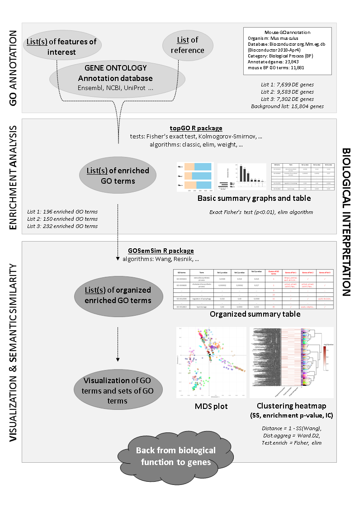

# ViSEAGO: a Bioconductor package for clustering biological functions using Gene Ontology and semantic similarity.

The main objective of ViSEAGO package is to carry out a data mining of biological functions and establish links between genes involved in the study. We developed ViSEAGO in R to facilitate functional Gene Ontology (GO) analysis of complex experimental design with multiple comparisons of interest. It allows to study large-scale datasets together and visualize GO profiles to capture biological knowledge. The acronym stands for three major concepts of the analysis: **Vi**sualization, **S**emantic similarity and **E**nrichment **A**nalysis of **G**ene **O**ntology. It provides access to the last current GO annotations, which are retrieved from one of NCBI EntrezGene, Ensembl or Uniprot databases for several species. Using available R packages and novel developments, ViSEAGO extends classical functional GO analysis to focus on functional coherence by aggregating closely related biological themes while studying multiple datasets at once. It provides both a synthetic and detailed view using interactive functionalities respecting the GO graph structure and ensuring functional coherence supplied by semantic similarity. ViSEAGO has been successfully applied on several datasets from different species with a variety of biological questions. Results can be easily shared between bioinformaticians and biologists, enhancing reporting capabilities while maintaining reproducibility.

## Installation

```r
# install package from Bioconductor
BiocManager::install("ViSEAGO")

## install package from gitLab
remotes::install_gitlab(
    "aurelien.brionne/ViSEAGO",
    host = "forgemia.inra.fr",
    build_opts = c("--no-resave-data", "--no-manual")
)

## install package from gitLab alternative
    # clone package (from prompt)
    git clone https://forgemia.inra.fr/umr-boa/viseago.git

    # build package (from R console) 
    devtools::build("ViSEAGO")

    # install package (from R console)
    install.packages("ViSEAGO_1.7.3.tar.gz", repos = NULL, type = "source")
```

## Citation

```r
citation("ViSEAGO")
```

## Overview


